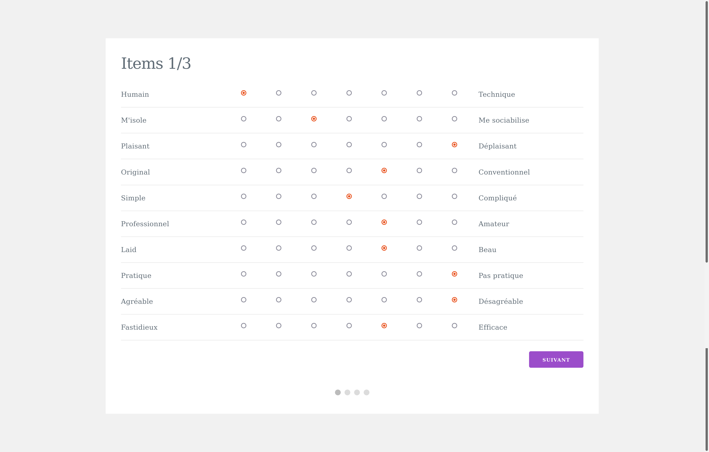
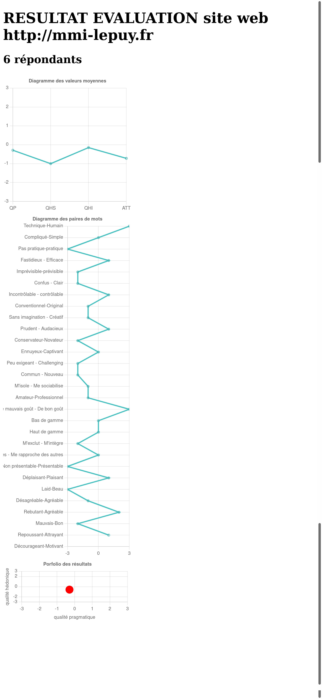

# Plateforme pour le questionnaire standardisé de l'évaluation de l'UX AttrakDiff
Cette application web permet de réaliser une session de tests avec le questionnaire standardisé **AttrakDiff** (version française) et de visualiser les résultats.

L'AttrakDiff est un questionnaire standardisé d'évaluation de l'expérience utilisateur (UX). Il comprend 4 sous-échelles de 7 items chacune, soit 28 items au total.
Les sous-échelles de l'AttrakDiff sont les suivantes :

- Echelle de **qualité pragmatique** (QP) : décrit l’utilisabilité́ du produit et indique à quel point le produit permet aux utilisateurs d’atteindre leur(s) but(s)
- Echelle de **qualité hédonique – stimulation** (QH-S) : indique dans quelle mesure le produit peut soutenir le besoin de stimulation
- Echelle de **qualité hédonique – identification** (QH-I) : indique dans quelle mesure le produit permet à l’utilisateur de s’identifier à lui
- Echelle d’**attractivité globale** (ATT) : décrit la valeur globale du produit basée sur la perception des qualités pragmatiques et hédoniques

## Outil

## Installation
1. Récupérez les fichiers du dépôt
2. Copiez-les sur votre serveur web Apache
3. Modifiez les paramètres de configuration dans le fichier config/configuration.php

        $typeelement='le site web'; // le site web / le produit / l'application
        $nom='http://mmi-lepuy.fr'; // nom de ce que l'on veut évaluer
        $motdepasse_admin='toto'; // mot de passe pour l'administrateur

Tout est prêt !

- Les testeurs remplissent le questionnaire en allant sur le site
- Les résultats sont accessibles à l'url /resultats (en indiquant le mot de passe)

## Ressources
Passation en ligne (pour les versions allemande et anglaise) sur le site [http://attrakdiff.de](http://attrakdiff.de)

Lallemand, C., Koenig, V., Gronier, G.,  &  Martin,  R. (2015).  Création  et  validation d'une  version  française  du  questionnaire  AttrakDiff  pour l’évaluation de  l’expérience  utilisateur  des  systèmes  interactifs,  Revue  Européenne  de  Psychologie  Appliquée.  [doi:10.1016/j.erap.2015.08.002](doi:10.1016/j.erap.2015.08.002)